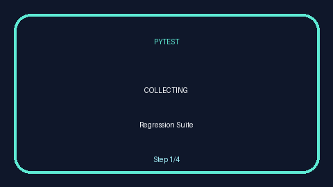

# Playwright AI Browser Use Showcase

[](./.github/workflows/ci.yml)
[](#coverage--quality-metrics)
[](#rich-reporting-allure--ctrf)

Automation framework for hybrid Playwright + AI agent experiences across curated demo applications and APIs. The suite runs classic scripted flows, AI-driven prompts via browser-use, and API contracts with full CI coverage on Windows, macOS, and Linux.

## Features

- ✅ Playwright + Pytest test harness with xdist parallelism and pytest-retry safety nets
- ✅ AI browser agent wrapper with deterministic stub fallback and transcript capture
- ✅ Page Object Model + business flows per application for maintainable E2E coverage
- ✅ Strict repo hygiene: Black, Ruff, isort, mypy (strict), Bandit, detect-secrets
- ✅ Rich reporting: pytest-html, Playwright traces/videos/screenshots, Allure, CTRF, AI transcripts
- ✅ CI matrix (Windows/macOS/Linux × Chromium/Firefox/WebKit) on every push & PR



## Getting Started

### Quick Commands

| Task | Linux / macOS | Windows PowerShell |
| --- | --- | --- |
| Create venv & install deps | `python3.12 -m venv .venv && source .venv/bin/activate && pip install -r requirements.txt` | `py -3.12 -m venv .venv; .\.venv\Scripts\activate; pip install -r requirements.txt` |
| Install Playwright browsers | `python -m playwright install --with-deps` | `python -m playwright install --with-deps` |
| Run regression + reports | `pytest -m "regression" --browser chromium --html=reports/run.html --self-contained-html --alluredir=reports/allure-results --clean-alluredir --ctreport=reports/ctreport.json` | same as Linux/macOS |
| Serve Allure dashboard | `allure serve reports/allure-results` | `allure serve reports\allure-results` |
| Export CTRF (re-run safe) | `pytest --ctreport=reports/ctreport.json` | `pytest --ctreport=reports\ctreport.json` |

### Clone & Bootstrap

```powershell
# Windows PowerShell
py -3.12 -m venv .venv
.\.venv\Scripts\activate
pip install -r requirements.txt
python -m playwright install --with-deps
```

### Run Regression Suite (deterministic stub)

```powershell
pytest -m "regression" --browser chromium --html=reports/run.html --self-contained-html --alluredir=reports/allure-results --clean-alluredir --ctreport=reports/ctreport.json
```

### Run with AI (Groq live)

```powershell
set ENABLE_AGENT=true
set LLM_PROVIDER=groq
set GROQ_API_KEY=sk_...
pytest -m "ai_live" -k agent --headed --browser chromium
```

### Force Stub (deterministic)

```powershell
set ENABLE_AGENT=false
set LLM_PROVIDER=stub
pytest -m "ai_stub" --browser chromium -n auto
```

> **Tip:** Without API keys or with `ENABLE_AGENT=false`, the framework automatically uses the deterministic stub provider, ensuring green CI runs.

## Dependency Management

- The canonical dependency definitions live in [`pyproject.toml`](pyproject.toml). Update runtime pins under `[project].dependencies` and developer tooling under `[project.optional-dependencies].dev`.
- After editing `pyproject.toml`, regenerate lock files so the ad-hoc installers stay aligned:

  ```bash
  pip install pip-tools
  pip-compile pyproject.toml --output-file requirements.txt
  pip-compile --extra dev pyproject.toml --output-file requirements-dev.txt
  ```

- Validate both workflows with `python -m pip install -r requirements-dev.txt` and `python -m pip install -e .[dev]` to ensure they resolve the same packages (aside from the editable entry for the local project).

## Project Structure

```
playwright-ai-browser-use/
├── agents/                 # browser-use guardrails and playbooks
├── ai/                     # LLM provider implementations (live + stub)
├── configs/                # env + settings + visual baselines
├── flows/                  # Business flows (multi-step with assertions)
├── fixtures/               # Pytest fixtures (browser, agents, data)
├── pages/                  # Page Object Model per target application
├── tests/                  # Batch-1: 20 test cases across web + API + AI
├── utils/                  # Settings loader, logger, deterministic data
├── reports/                # Artifacts (html, traces, videos, transcripts)
└── .github/workflows/ci.yml
```

## Test Metadata Convention

Every test begins with a metadata docstring and uses descriptive filenames:

```python
"""
@meta:
  TC: TC-001
  REQ: SD-ORD-001
  TAGS: [e2e, smoke, regression]
  SITE: SauceDemo
  MODE: classic
"""
```

## AI Agent Guardrails

- Allow-list enforced domains (SauceDemo, Demoblaze, BooksToScrape, The-Internet, Parabank, ReqRes, Countries)
- Configurable time budgets and max steps
- Automatic transcript persistence to `reports/ai_transcripts/<TC-ID>.jsonl`
- Deterministic stub provider for CI / offline execution

## Rich Reporting: Allure & CTRF

- HTML: `--html=reports/run.html --self-contained-html` keeps legacy reporting for quick review.
- **Allure**: `--alluredir=reports/allure-results --clean-alluredir` persists structured results; open them locally with `allure serve reports/allure-results` or publish via Allure Server.
- **Common Test Report Format (CTRF)**: `--ctreport=reports/ctreport.json` produces an evergreen machine-consumable report for analytics platforms such as TestOps or Trace32.
- Allure, CTRF, and HTML artifacts are uploaded automatically from CI for every matrix leg.

## Coverage & Quality Metrics

- Run coverage locally with `coverage run -m pytest -m "regression"` followed by `coverage html` for drill-down dashboards in `htmlcov/`.
- Export a badge-ready summary using `coverage report --skip-covered --format markdown`.
- CI gate surfaces coverage deltas alongside lint/type/security steps, keeping quality transparent to reviewers.

## Quality Tooling

- `ruff`, `black`, `isort`, `mypy --strict`, `bandit`, `detect-secrets`
- `pre-commit install` to activate hooks locally
- `pytest-html`, Allure, CTRF, Playwright trace/video/screenshot, AI transcripts for evidence

## Continuous Integration

- `.github/workflows/ci.yml` runs lint/type/security gates followed by the full regression matrix (3 OS × 3 browsers)
- Artifacts uploaded per job (HTML report, Allure results, CTRF export, traces, videos, screenshots, transcripts)
- Fail-fast on violations to maintain green mainline

## Adding New Tests (TC-021+)

1. Create a new module under the appropriate `tests/` subfolder using the naming convention `test_<area>__<slug>__tc_0xx.py`.
2. Start with the metadata docstring and tag the test with relevant `pytest` markers.
3. Reuse existing Page Objects and flows; add new ones under `pages/` or `flows/` with accompanying unit coverage where necessary.
4. Capture artifacts through the shared fixtures (traces, screenshots handled automatically).
5. Run `pytest -m "regression and tc_021"` (example) locally before raising a PR.
6. Update documentation or baselines if the test introduces new behavior or artifacts.

## Troubleshooting

- **Agent requests hitting non-allow-listed domains** → update `configs/settings.toml` allow list and corresponding env vars.
- **Playwright browser mismatch** → reinstall browsers with `python -m playwright install --with-deps`.
- **Flaky scenarios** → mark with `@pytest.mark.flaky` and document mitigation; still fails CI summary per policy.

For additional contribution guidelines and PR checklist, see [CONTRIBUTING.md](CONTRIBUTING.md).
